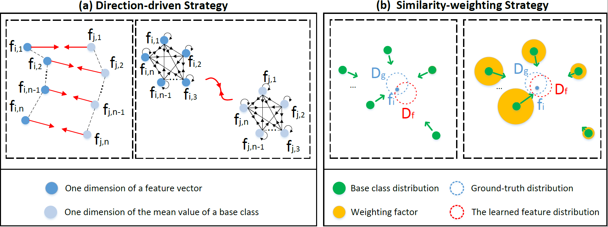

#  Feature Distribution Fitting with Direction-Driven Weighting for Few-Shot Images Classification



## Backbone Training

We use the same backbone network and training strategies as 'S2M2_R'. Please refer to https://github.com/nupurkmr9/S2M2_fewshot for the backbone training.

## Extract and save features

After training the backbone as 'S2M2_R', extract features as below:

- Create an empty 'checkpoints' directory.

- Run:
```save_features
python save_features.py --dataset [miniImagenet/CUB/CIFAR-FS] 
```
### Or you can directly download the extracted features/pretrained models from the link:
https://drive.google.com/drive/folders/1plWYjXC-9-to1v2sXq94NCPq_mE0dChJ?usp=sharing


After downloading the extracted features, please adjust your file path according to the code.


## Evaluation

To evaluate our DDWM method, run:

```eval
python DDWM.py
```

## Reference

[Charting the Right Manifold: Manifold Mixup for Few-shot Learning](https://arxiv.org/pdf/1907.12087v3.pdf)

[https://github.com/nupurkmr9/S2M2_fewshot](https://github.com/nupurkmr9/S2M2_fewshot)

[On the Importance of Firth Bias Reduction in Few-Shot Classification](https://openreview.net/pdf?id=DNRADop4ksB)

[https://github.com/sabagh1994/code_dcf/tree/5667ee348adce0856fafb2089bfa88aad51be413](https://github.com/sabagh1994/code_dcf/tree/5667ee348adce0856fafb2089bfa88aad51be413)

[Free Lunch for Few-Shot Learning: Distribution Calibration](https://openreview.net/forum?id=JWOiYxMG92s)

[https://github.com/ShuoYang-1998/Few_Shot_Distribution_Calibration](https://github.com/ShuoYang-1998/Few_Shot_Distribution_Calibration)

